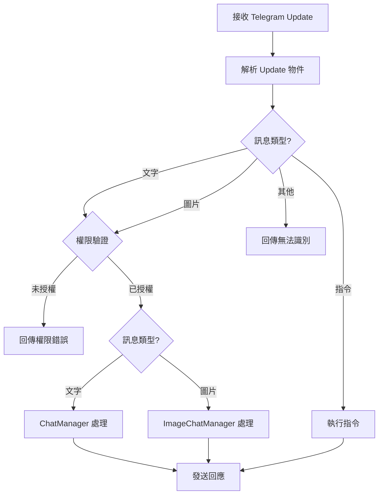
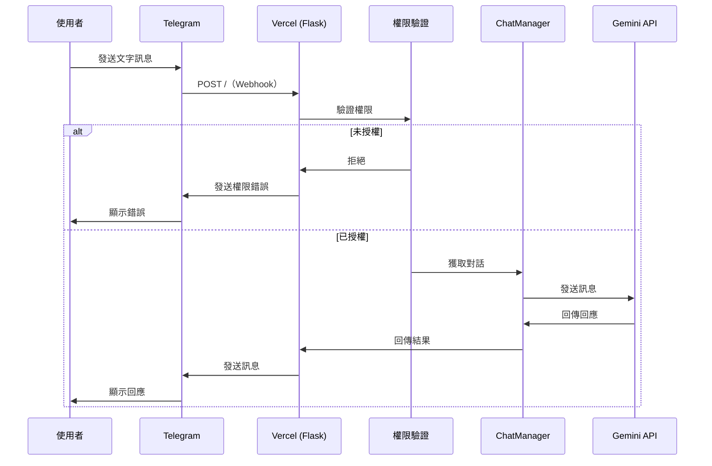
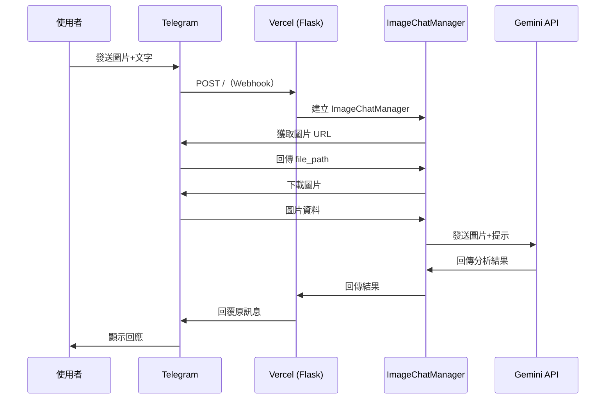
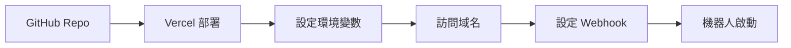

# tg-gemini-bot 專案分析

## 專案概述

**tg-gemini-bot** 是一個整合 Google Gemini AI 服務與 Telegram 機器人的專案，讓使用者可以直接在 Telegram 上與 Gemini AI 進行對話。此專案設計為可一鍵部署到 Vercel 的無伺服器應用程式。

### 核心特性

- ✅ **Flask 框架**：使用輕量級的 Flask 框架，易於開發和維護
- ✅ **Vercel 部署**：完全前端化的專案，支援一鍵部署到 Vercel
- ✅ **連續對話**：支援 Gemini 的連續對話功能（受 Vercel 限制，對話可能無法長期保存）
- ✅ **多模態支援**：支援文字和圖片輸入，並支援 Telegram Markdown 格式
- ✅ **權限控制**：支援使用者和群組的白名單驗證
- ✅ **群組模式**：支援在 Telegram 群組中使用，可選擇共用或個別對話歷史

---

## 技術架構

### 技術棧

| 技術 | 版本 | 用途 |
|------|------|------|
| Python | 3.x | 主要開發語言 |
| Flask | 3.0.0 | Web 框架 |
| google-generativeai | 0.3.2 | Google Gemini API SDK |
| requests | 2.31.0 | HTTP 請求處理 |
| Pillow | 10.1.0 | 圖片處理 |
| md2tgmd | custom | Markdown 轉 Telegram Markdown |

### 專案結構

```
tg-gemini-bot-main/
├── api/
│   ├── __init__.py
│   ├── index.py           # Flask 應用主入口
│   ├── handle.py          # 訊息處理核心邏輯
│   ├── gemini.py          # Gemini API 整合
│   ├── telegram.py        # Telegram API 整合
│   ├── context.py         # 對話管理器
│   ├── auth.py            # 權限驗證
│   ├── command.py         # 指令處理
│   ├── config.py          # 配置管理
│   ├── printLog.py        # 日誌系統
│   └── templates/
│       └── status.html    # Webhook 設定頁面
├── screenshots/           # 截圖資源
├── requirements.txt       # Python 依賴
├── vercel.json           # Vercel 部署配置
├── README.md             # 英文說明文件
└── README_zh-CN.md       # 中文說明文件
```

---

## 核心模組分析

### 1. index.py - 應用入口

**功能**：Flask 應用的主入口點

```python
@app.route("/", methods=["POST", "GET"])
def home():
    if request.method == "POST":
        update = request.json
        handle_message(update)
        return "ok"
    return render_template("status.html")
```

**設計特點**：
- POST 請求：接收 Telegram webhook 的更新
- GET 請求：顯示 webhook 設定頁面
- 簡潔的路由設計，所有邏輯委派給 `handle_message`

---

### 2. handle.py - 訊息處理核心

**功能**：處理所有來自 Telegram 的訊息

**處理流程**：



**關鍵邏輯**：
- **權限檢查**：在處理訊息前先驗證使用者/群組權限
- **群組模式**：根據 `GROUP_MODE` 決定是共用還是個別對話歷史
- **日誌記錄**：詳細記錄所有互動（需啟用 DEBUG 模式）

---

### 3. gemini.py - Gemini API 整合

**核心類別**：

#### ChatConversation 類別

```python
class ChatConversation:
    def __init__(self):
        self.chat = model_usual.start_chat(history=[])
    
    def send_message(self, prompt: str) -> str:
        if prompt.startswith("/new"):
            self.__init__()  # 重置對話
            return new_chat_info
        else:
            response = self.chat.send_message(prompt)
            return response.text
```

**特點**：
- 維護對話歷史
- 支援 `/new` 指令重置對話
- 錯誤處理機制

#### 圖片處理

```python
def generate_text_with_image(prompt: str, image_bytes: BytesIO) -> str:
    img = PIL.Image.open(image_bytes)
    response = model_vision.generate_content([prompt, img])
    return response.text
```

**模型配置**：
- 文字模型：`gemini-1.0-pro`
- 視覺模型：`gemini-1.0-pro`（注意：原始碼中兩者使用相同模型名稱，可能需要更新）
- 安全設定：所有類別設為 `BLOCK_NONE`

---

### 4. telegram.py - Telegram API 整合

**Update 類別**：封裝 Telegram 更新物件

```python
class Update:
    def __init__(self, update: Dict):
        self.from_id = update["message"]["from"]["id"]
        self.chat_id = update["message"]["chat"]["id"]
        self.is_group = self._is_group()
        self.type = self._type()  # "text", "photo", "command"
        self.text = self._text()
        self.photo_caption = self._photo_caption()
        self.file_id = self._file_id()
```

**訊息類型判斷**：
- **指令**：以 `/` 開頭（除了 `/new`）
- **文字**：普通文字訊息
- **圖片**：包含照片的訊息

**Markdown 轉換**：
- 使用 `md2tgmd` 套件將 Markdown 轉換為 Telegram MarkdownV2 格式
- 自動轉義特殊字元

---

### 5. context.py - 對話管理

#### ChatManager 類別

```python
class ChatManager:
    def __init__(self):
        self.chats: Dict[int, ChatConversation] = {}
    
    def get_chat(self, history_id: int) -> ChatConversation:
        if self.chats.get(history_id) is None:
            return self._new_chat(history_id)
        return self.chats[history_id]
```

**設計模式**：
- 使用字典管理多個使用者的對話
- 延遲初始化：首次訪問時才建立對話

#### ImageChatManager 類別

```python
class ImageChatManger:
    def tel_photo_url(self) -> str:
        # 從 Telegram 獲取圖片 URL
    
    def photo_bytes(self) -> BytesIO:
        # 下載圖片並轉換為 BytesIO
    
    def send_image(self) -> str:
        # 發送圖片給 Gemini 並獲取回應
```

**特點**：
- 圖片處理無上下文（Gemini Pro 限制）
- 動態從 Telegram 下載圖片

---

### 6. auth.py - 權限驗證

```python
def is_authorized(is_group, from_id: int, user_name: str, 
                  chat_id, group_name) -> bool:
    if AUCH_ENABLE == "0":
        return True
    
    if is_group:
        return (str(group_name).lower() in ALLOWED_GROUPS or 
                str(chat_id) in ALLOWED_GROUPS)
    else:
        return (str(user_name).lower() in ALLOWED_USERS or 
                str(from_id) in ALLOWED_USERS)
```

**驗證機制**：
- 支援使用者名稱或 ID 驗證
- 支援群組名稱或 ID 驗證
- 可完全關閉驗證（`AUCH_ENABLE=0`）

---

### 7. command.py - 指令處理

**支援的指令**：

| 指令 | 權限 | 功能 |
|------|------|------|
| `/start`, `/help` | 所有人 | 顯示幫助資訊 |
| `/new` | 所有人 | 開始新對話（在 gemini.py 處理） |
| `/get_my_info` | 所有人 | 獲取個人 ID |
| `/get_group_info` | 群組 | 獲取群組 ID |
| `/5g_test` | 所有人 | 速度測試（彩蛋） |
| `/get_allowed_users` | 管理員 | 查看允許的使用者列表 |
| `/get_allowed_groups` | 管理員 | 查看允許的群組列表 |
| `/list_models` | 管理員 | 列出可用的 Gemini 模型 |
| `/get_api_key` | 管理員 | 查看 API 金鑰 |

**管理員指令**：
- 需要設定 `ADMIN_ID`
- 需要啟用 `IS_DEBUG_MODE=1`

---

### 8. config.py - 配置管理

**環境變數**：

| 變數 | 必須 | 說明 |
|------|------|------|
| `BOT_TOKEN` | ✅ | Telegram 機器人 Token |
| `GOOGLE_API_KEY` | ✅ | Google Gemini API 金鑰（支援多個） |
| `ALLOWED_USERS` | ❌ | 允許的使用者列表 |
| `ALLOWED_GROUPS` | ❌ | 允許的群組列表 |
| `ADMIN_ID` | ❌ | 管理員 ID |
| `IS_DEBUG_MODE` | ❌ | 是否啟用除錯模式（0/1） |
| `AUCH_ENABLE` | ❌ | 是否啟用權限驗證（0/1） |
| `GROUP_MODE` | ❌ | 群組模式（1=共用/2=個別） |

**Gemini 配置**：
```python
generation_config = {
    "max_output_tokens": 1024,
}

safety_settings = [
    {"category": "HARM_CATEGORY_HARASSMENT", "threshold": "BLOCK_NONE"},
    {"category": "HARM_CATEGORY_HATE_SPEECH", "threshold": "BLOCK_NONE"},
    {"category": "HARM_CATEGORY_SEXUALLY_EXPLICIT", "threshold": "BLOCK_NONE"},
    {"category": "HARM_CATEGORY_DANGEROUS_CONTENT", "threshold": "BLOCK_NONE"},
]
```

---

### 9. printLog.py - 日誌系統

**功能**：
- 當 `IS_DEBUG_MODE=1` 時，將日誌發送到管理員的 Telegram
- 支援文字和圖片日誌
- 使用 Telegram MarkdownV2 格式

**優點**：
- 即時監控機器人運作狀態
- 無需登入伺服器查看日誌

---

## 資料流程

### 文字訊息處理流程



### 圖片訊息處理流程



---

## 部署架構

### Vercel 配置

**vercel.json**：
```json
{
  "rewrites": [
    { "source": "/(.*)", "destination": "/api/index" }
  ]
}
```

**特點**：
- 所有請求重定向到 `/api/index`
- 無伺服器架構，自動擴展
- 支援環境變數配置

### 部署流程



**步驟**：
1. 點擊 "Deploy to Vercel" 按鈕
2. 設定環境變數（`BOT_TOKEN`, `GOOGLE_API_KEY`, `ALLOWED_USERS` 等）
3. 部署完成後訪問 Vercel 提供的域名
4. 在網頁上輸入 Bot Token 並點擊 "setWebhook"
5. 機器人開始運作

---

## 安全性考量

### 優點

✅ **權限控制**：支援白名單機制
✅ **環境變數**：敏感資訊存儲在環境變數中
✅ **HTTPS**：Vercel 自動提供 HTTPS

### 潛在風險

⚠️ **API 金鑰暴露**：
- `/get_api_key` 指令會將 API 金鑰發送到 Telegram
- 建議：移除此功能或加強保護

⚠️ **日誌洩漏**：
- 除錯模式會將所有訊息內容發送到管理員
- 建議：確保管理員帳號安全

⚠️ **無速率限制**：
- 沒有實作 API 呼叫速率限制
- 建議：加入速率限制機制

⚠️ **錯誤訊息**：
- 錯誤訊息可能洩漏系統資訊
- 建議：對使用者隱藏詳細錯誤

---

## 限制與挑戰

### Vercel 平台限制

| 限制 | 影響 |
|------|------|
| 無狀態 | 對話歷史可能丟失（重新部署時） |
| 執行時間限制 | 長時間處理可能超時 |
| 記憶體限制 | 大量並發可能受限 |

### Gemini API 限制

- 圖片處理無上下文
- API 配額限制
- 回應長度限制（1024 tokens）

### Telegram 限制

- 訊息長度限制（4096 字元）
- 檔案大小限制
- 群組權限要求

---

## 改進建議

### 功能增強

1. **持久化儲存**
   - 使用外部資料庫（如 Redis、MongoDB）儲存對話歷史
   - 實作對話備份與恢復機制

2. **多 API 金鑰輪換**
   - 程式碼已支援多個 API 金鑰，但未實作自動切換
   - 可加入負載平衡和錯誤重試機制

3. **更豐富的指令**
   - 設定個人化參數（如語言、回應長度）
   - 查看對話統計
   - 匯出對話歷史

4. **圖片上下文支援**
   - 若 Gemini 未來支援，可加入圖片對話歷史

### 程式碼品質

1. **錯誤處理**
   - 加強異常處理邏輯
   - 實作重試機制

2. **測試**
   - 加入單元測試
   - 加入整合測試

3. **文件**
   - 加入程式碼註解
   - 建立 API 文件

4. **重構**
   - 分離配置與程式碼
   - 使用依賴注入提升可測試性

### 安全性

1. **速率限制**
   - 實作使用者級別的速率限制
   - 防止 API 濫用

2. **輸入驗證**
   - 驗證所有使用者輸入
   - 防止注入攻擊

3. **日誌脫敏**
   - 移除日誌中的敏感資訊
   - 實作日誌分級

---

## 程式碼品質評估

### 優點

✅ **結構清晰**：模組化設計，職責分明
✅ **易於部署**：一鍵部署到 Vercel
✅ **文件完善**：提供中英文 README
✅ **功能完整**：支援文字、圖片、群組等多種場景

### 待改進

⚠️ **硬編碼**：部分配置寫死在程式碼中
⚠️ **錯誤處理**：部分地方缺少異常處理
⚠️ **測試覆蓋**：缺少自動化測試
⚠️ **型別提示**：部分函數缺少型別註解

---

## 使用場景

### 適合

✅ 個人 AI 助手
✅ 小型團隊協作
✅ 學習 Gemini API 整合
✅ 快速原型開發

### 不適合

❌ 大規模商業應用（無持久化）
❌ 高併發場景（Vercel 限制）
❌ 需要長期對話歷史的應用

---

## 總結

**tg-gemini-bot** 是一個設計精巧、易於部署的 Telegram 機器人專案，成功整合了 Google Gemini AI 服務。其主要優勢在於：

1. **簡單易用**：一鍵部署，配置簡單
2. **功能完整**：支援文字、圖片、群組等多種場景
3. **架構清晰**：模組化設計，易於理解和擴展

然而，由於採用 Vercel 無伺服器架構，存在對話歷史無法持久化的限制。對於個人使用或小型專案來說，這是一個非常好的起點；但若要用於生產環境，建議加入持久化儲存、速率限制等企業級功能。

**評分**：⭐⭐⭐⭐ (4/5)
- 功能性：⭐⭐⭐⭐⭐
- 程式碼品質：⭐⭐⭐⭐
- 安全性：⭐⭐⭐
- 可擴展性：⭐⭐⭐
- 文件完整度：⭐⭐⭐⭐⭐
